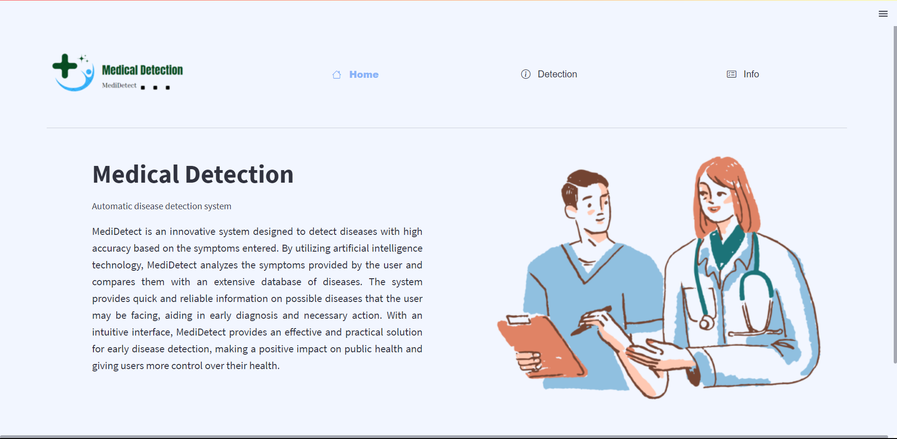
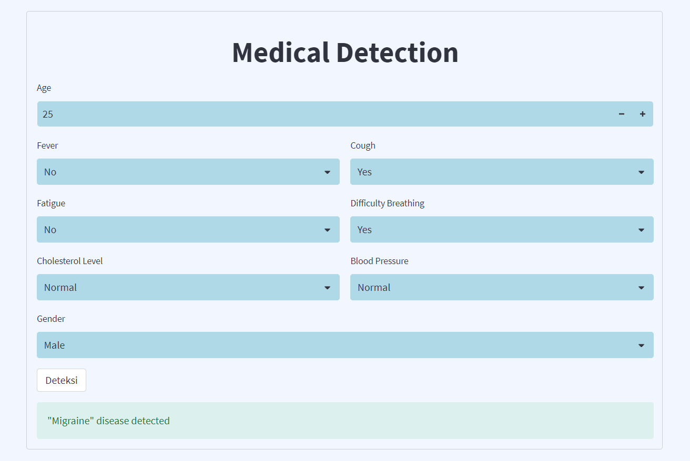
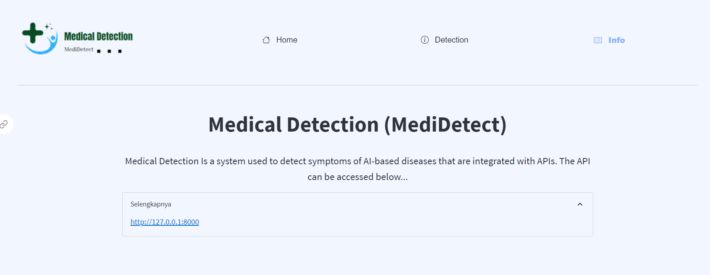
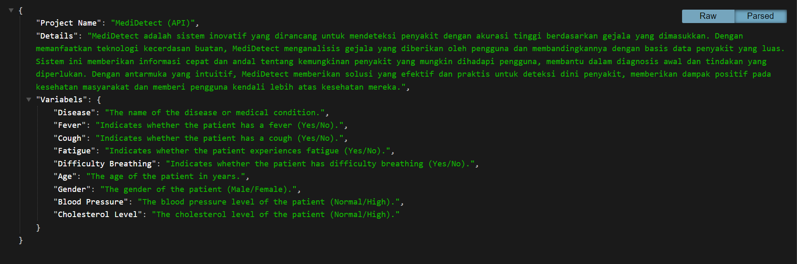
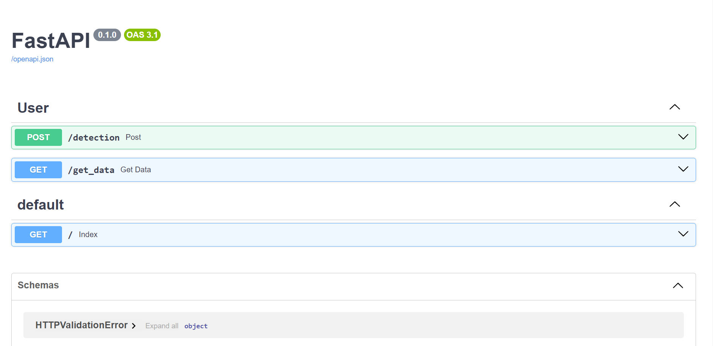

# List of contents
- [Title and Description](#Medical-Detection(MediDetect))
   - [Dataset](#Dataset)
- [Main-Features](#Main-Features)
   - [Model Building](#Model-Building)
   - [API (FastAPI)](#FastAPI)
   - [Frontend (Streamlit)](#frontendstreamlit)
- [Technology and Programming Language](#Technology-and-Programming-Language)
- [How to Run the Program](#How-to-Run-the-Program)
- [Preview](#preview)

# Medical-Detection(MediDetect)
This project is a platform that combines machine learning models, a user-friendly frontend using Streamlit, and an API with FastAPI. It is a complete solution for predicting diseases based on the patient's symptoms.

## Dataset Information
Disease: The name of the disease or medical condition.  
Fever: Indicates whether the patient has a fever (Yes/No).  
Cough: Indicates whether the patient has a cough (Yes/No).  
Fatigue: Indicates whether the patient experiences fatigue (Yes/No).  
Difficulty Breathing: Indicates whether the patient has difficulty breathing (Yes/No).  
Age: The age of the patient in years.  
Gender: The gender of the patient (Male/Female).  
Blood Pressure: The blood pressure level of the patient (Normal/High).  
Cholesterol Level: The cholesterol level of the patient (Normal/High).  
Outcome Variable: The outcome variable indicating the result of the diagnosis or assessment for the specific disease (Positive/Negative).  

# Main-Features
## Model-Building
there are several stages in making a model which consists of:
1. Exploratory Data Analysis  
   is the exploration stage of the data used such as the average age of patients, the comparison of diseases between men and women and many more.
2. Preprocessing  
   preprocessing is the stage of preparing and cleaning raw data before it is used to train machine learning models, this preprocessing has 3 stages, namely labelencoder, minmax scaler and smote.
3. Modelling
   is the stage of making machine learning models starting from dividing data into testing and training, modeling with several models as a comparison, tuning parameters and model evaluation

File : `modeling.ipynb`  
## FastAPI
This api serves to detect diseases using a machine learning model that has been made before, the api created has 2 operations, namely detection to classify diseases and the second is get_data to see the dataset used.

File : `API/main.py`  

## Frontend(Streamlit)
The web built using streamlit is quite simple, has 3 menus namely home, detection and info.

File : `web-based.py`  

# Technology-and-Programming-Language
- Programming Language: Python  
- Frontend: Streamlit  
- API: FastAPI  

# How-to-Run-the-Program
1. install library (pip install -r requirements.txt).
2. python main.py.

Make sure you have Python 3.7+ installed before running this program.

# Preview
## Frontend
### Home

### Detection

### Info

## API

